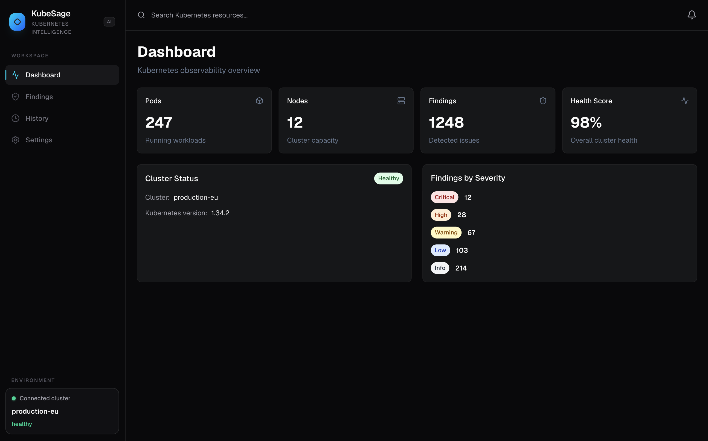
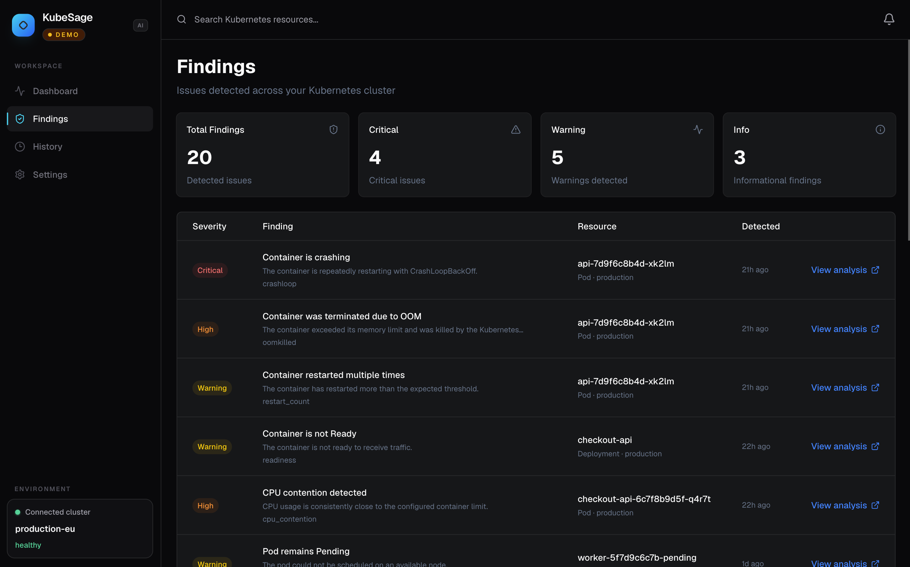
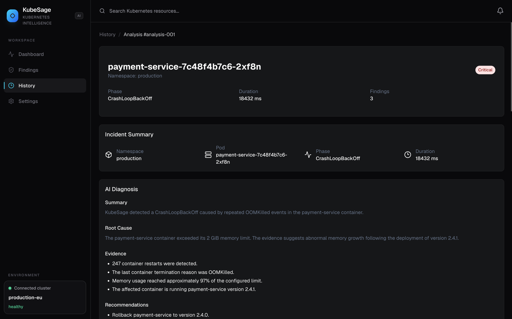

<h1 align="center">🤖 KubeSage Frontend</h1>

<p align="center">
  
</p>

<p align="center">
Web frontend for KubeSage, a platform designed to analyze and diagnose Kubernetes incidents.
</p>

<h4 align="center">


[](https://github.com/fdebar/kubesage-frontend/actions/workflows/ci.yml)
</h4>

# KubeSage Frontend

Web frontend for **KubeSage**, a platform designed to analyze and diagnose Kubernetes incidents.

KubeSage combines Kubernetes cluster state, metrics, events, and analysis results to help users quickly understand what is happening when an incident occurs.

This repository contains only the **KubeSage frontend**. The backend API is developed and maintained in a separate repository.

---

## 🧭 Overview

KubeSage is designed to help teams quickly understand what is happening in a Kubernetes cluster when an incident occurs.

The current architecture is based on:

```text
┌─────────────────────┐
│   kubesage-frontend │
│                     │
│ React / TypeScript  │
│ Vite / Tailwind     │
└──────────┬──────────┘
           │ HTTP
           ▼
┌─────────────────────┐
│    KubeSage API     │
│                     │
│ FastAPI / Python    │
└──────────┬──────────┘
           │
           ├── Kubernetes
           ├── Prometheus
           ├── PostgreSQL
           └── Observability stack
```

The frontend is responsible for the **presentation and exploration of data**, while the KubeSage API handles the business logic and analysis.
---

## 📸 Screenshots

### Dashboard



### Findings



### Analysis



---

## ✨ Features

The frontend currently provides several views for exploring the state of the cluster and KubeSage analyses.

### Dashboard

The **Dashboard** provides a high-level overview of the system:

* overall cluster status;
* resource and incident counts;
* findings summary;
* key indicators;
* overall KubeSage status.

### Findings

The **Findings** view allows users to explore issues detected by the KubeSage analysis engine.

Findings can represent issues detected at different levels, including:

* pods;
* containers;
* Kubernetes resources;
* metrics;
* events.

### Analyses

The **Analyses** view provides access to analyses performed by KubeSage and their results.

An analysis can rely on:

* Kubernetes resource state;
* Prometheus metrics;
* available logs and events;
* diagnostic rules;
* correlations between multiple findings.

### History

The **History** view allows users to browse previously performed analyses and review their results.

### Settings

A dedicated **Settings** page provides a central location for application configuration exposed to users.

---

## 🛠️ Technology Stack

The frontend is built primarily with:

| Technology         | Purpose                              |
| ------------------ | ------------------------------------ |
| **React**          | UI framework                         |
| **TypeScript**     | Static typing                        |
| **Vite**           | Development server and build tooling |
| **Tailwind CSS**   | Styling                              |
| **shadcn/ui**      | UI components                        |
| **TanStack Query** | Server-state management and caching  |
| **npm**            | Package management                   |

The application communicates with the KubeSage backend through its HTTP API.

---

## 🔗 KubeSage API

The frontend depends on the **KubeSage API**, which exposes the endpoints required by the web application.

The frontend and backend are intentionally maintained as separate repositories in order to keep a clear separation between:

* **Frontend** → user interface and data exploration;
* **API** → business logic, analysis, and data access;
* **Infrastructure** → Kubernetes, Prometheus, PostgreSQL, and observability.

This separation allows the frontend and backend to evolve and be deployed independently while communicating through a well-defined HTTP API.

---

## 🚀 Getting Started

### Prerequisites

Make sure the following are installed:

* Node.js
* npm

Check your installed versions:

```bash
node --version
npm --version
```

### Clone the repository

```bash
git clone https://github.com/fdebar/kubesage-frontend.git
cd kubesage-frontend
```

### Install dependencies

```bash
npm install
```

---

## ⚙️ Configuration

The frontend uses an environment variable to define the KubeSage API URL.

Create a `.env.local` file:

```env
VITE_API_URL=http://localhost:8000
```

The value must point to the instance where **KubeSage API** is running.

For example:

```env
VITE_API_URL=http://localhost:8000
```

or, when the API is deployed remotely:

```env
VITE_API_URL=https://kubesage-api.example.com
```

> `VITE_API_URL` is a frontend configuration value and must not contain secrets.

---

## 💻 Development

Start the development server:

```bash
npm run dev
```

By default, Vite serves the application at:

```text
http://localhost:5173
```

The frontend must be able to communicate with a running instance of **KubeSage API**.

A typical local setup looks like this:

```text
Browser
   │
   │ http://localhost:5173
   ▼
KubeSage Frontend
   │
   │ http://localhost:8000
   ▼
KubeSage API
```

---

## 🏗️ Build

Create a production build:

```bash
npm run build
```

The production build is generated in:

```text
dist/
```

The resulting static files can be served by any web server capable of serving a single-page application.

> Docker is not currently used for the frontend.

---

## 🧪 Tests and Code Quality

Available scripts can be found in `package.json`.

Depending on the project configuration, common checks include:

```bash
npm run lint
npm run build
```

The TypeScript/Vite build also provides an important validation step before publishing a new version of the frontend.

---

## 📁 Project Structure

The project separates pages, reusable components, and data-access logic.

A simplified structure looks like this:

```text
src/
├── components/
│   ├── common/
│   └── ...
├── hooks/
│   ├── useAnalysis.ts
│   ├── useAnalyses.ts
│   └── useDashboard.ts
├── pages/
│   ├── DashboardPage.tsx
│   ├── FindingsPage.tsx
│   ├── AnalysesPage.tsx
│   ├── HistoryPage.tsx
│   └── SettingsPage.tsx
├── ...
└── main.tsx
```

Hooks built around **TanStack Query** encapsulate interactions with the API, keeping UI components independent from server-state management, loading states, and caching.

---

## 🔭 Roadmap

The frontend will evolve alongside KubeSage's analysis capabilities.

Planned improvements include:

* richer dashboard visualizations;
* improved findings exploration;
* deeper analysis and incident context;
* detailed incident history;
* integration with traces and observability data;
* visualization of correlations between findings;
* improved incident investigation workflows;
* progressive integration of KubeSage's AI-assisted analysis capabilities.

The long-term goal is to evolve the interface from a simple dashboard into a **dedicated Kubernetes incident investigation console**.

---

## 🤝 KubeSage Project

KubeSage is composed of several independent components.

The frontend provides the presentation layer:

```text
                    KubeSage
                       │
           ┌───────────┴───────────┐
           │                       │
      kubesage-frontend       kubesage-api
           │                       │
        React UI             FastAPI / Python
                                   │
                       ┌───────────┼───────────┐
                       │           │           │
                  Kubernetes   Prometheus   PostgreSQL
```

This separation allows the frontend and backend to be developed and deployed independently while communicating through a common API.

---

## 📄 License

To be defined according to the license selected for KubeSage.
