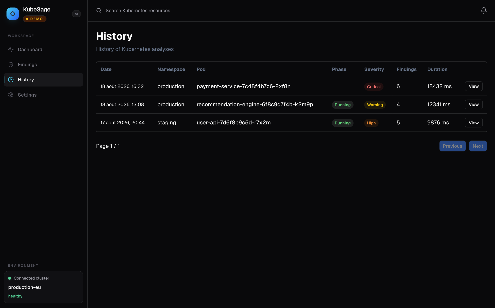

<h1 align="center">🤖 KubeSage Web</h1>

<p align="center">
  
</p>

<p align="center">
  <strong>Kubernetes incident investigation, powered by data and AI.</strong>
</p>

<p align="center">
  A web interface for exploring cluster health, findings and incident analyses with KubeSage.
</p>

<p align="center">
  <a href="https://fdebar.github.io/kubesage-web/">
    <strong>🚀 Live Demo</strong>
  </a>
</p>

<p align="center">
  <em>The public demo runs entirely with mock data — no Kubernetes cluster or backend required.</em>
</p>

<h4 align="center">


[](https://github.com/fdebar/kubesage-web/actions/workflows/ci.yml)

</h4>

---

## 📖 What is KubeSage?

**KubeSage** is a Kubernetes incident investigation platform designed to help engineers understand what is happening when an incident occurs.

Instead of looking at cluster state, metrics, logs and diagnostic information separately, KubeSage brings them together into a single investigation workflow.

The platform is designed around the following flow:

```text
                    Kubernetes Incident
                            │
                            ▼
                  ┌───────────────────┐
                  │     KubeSage      │
                  │                   │
                  │  Cluster state    │
                  │  Metrics          │
                  │  Logs             │
                  │  Events           │
                  │  Diagnostics      │
                  │  Correlations     │
                  │  AI analysis      │
                  └─────────┬─────────┘
                            │
                            ▼
                   Incident Investigation
```

**KubeSage Web** provides the visual investigation experience, while the KubeSage API handles data collection, analysis and business logic.

This repository contains the **KubeSage web application**.

---

## 🚀 Live Demo

The frontend is publicly available through GitHub Pages:

<p align="center">
  <a href="https://fdebar.github.io/kubesage-web/">
    <strong>👉 Open the KubeSage Web Demo</strong>
  </a>
</p>

The live demo runs in **Demo Mode** using realistic mock data.

No Kubernetes cluster, observability stack or KubeSage API is required.

This makes the application immediately accessible for:

- exploring the UI;
- demonstrating the project;
- reviewing the incident investigation workflow;
- evaluating the frontend architecture;
- sharing KubeSage without deploying the complete platform.

The demo is automatically deployed through **GitHub Actions** whenever changes are pushed to the main branch.

---

## 📸 Interface

KubeSage Web provides a dedicated interface for moving from a high-level cluster overview to detailed incident investigation.

### Dashboard

The Dashboard provides a high-level overview of the cluster and KubeSage activity.


### Findings

Findings provide a structured view of issues detected during analysis, with context about the affected Kubernetes resources.


### Analysis

An analysis brings together the information collected during an incident investigation and presents the resulting diagnostic information.


### History

The History view provides access to previously performed analyses and allows engineers to revisit past incidents.



---

## ✨ Features

### 📊 Cluster Dashboard

The Dashboard provides an overview of the current state of the environment, including:

- cluster health;
- resource information;
- incident and finding counts;
- findings summary;
- key KubeSage indicators.

The goal is to provide enough context to quickly identify whether further investigation is required.

### 🔎 Findings Exploration

Findings represent issues detected by KubeSage's diagnostic engine.

They can be associated with different Kubernetes resources and signals, including:

- Pods;
- containers;
- workloads;
- resource usage;
- Kubernetes events;
- diagnostic rules.

Findings are presented in a structured way so that engineers can quickly identify the most relevant problems.

### 🧠 Incident Analysis

The Analysis view presents the results of an individual KubeSage investigation.

An analysis can combine information from multiple sources:

- Kubernetes resources;
- Prometheus metrics;
- logs;
- events;
- diagnostic rules;
- correlations between findings;
- AI-assisted analysis.

The goal is to provide context and relationships between signals rather than simply report an isolated alert.

### 🕘 Analysis History

The History view allows previously performed analyses to be explored and revisited.

This provides a foundation for building a longer-term incident investigation workflow.

### ⚙️ Settings

The Settings view provides a dedicated place for application-level configuration exposed by the frontend.

---

## 🎮 Demo Mode

KubeSage Web includes a **Demo Mode** powered by local mock data.

Demo Mode makes it possible to explore the application without running:

- a Kubernetes cluster;
- the KubeSage API;
- Prometheus;
- Loki;
- Tempo;
- the rest of the KubeSage observability stack.

The mock data reproduces realistic application states so that the complete frontend experience can be explored independently of the backend.

Demo Mode is used by the public GitHub Pages deployment.

It is also useful for:

- local frontend development;
- UI development;
- demonstrations;
- screenshots;
- testing application states;
- evaluating the project without deploying the complete KubeSage platform.

---

## 🛠️ Technology Stack

| Technology         | Purpose                              |
| ------------------ | ------------------------------------ |
| **React**          | UI framework                         |
| **TypeScript**     | Static typing                        |
| **Vite**           | Development server and build tooling |
| **Tailwind CSS**   | Styling                              |
| **shadcn/ui**      | Reusable UI components               |
| **TanStack Query** | Server-state management and caching  |
| **React Router**   | Application routing                  |
| **npm**            | Package management                   |

The application follows a component-based architecture with feature-oriented organization where appropriate.

Data-access logic is kept separate from presentation components, while reusable hooks encapsulate server-state interactions and caching.

---

## 📁 Project Structure

The project separates application features, reusable UI components, API access, types and mock data.

A simplified structure looks like:

```text
src/
├── api/
│   └── ...
├── app/
│   └── ...
├── components/
│   ├── common/
│   └── ui/
├── config/
│   └── ...
├── features/
│   ├── analysis/
│   ├── dashboard/
│   ├── findings/
│   ├── history/
│   └── settings/
├── hooks/
│   └── ...
├── mocks/
│   └── ...
├── types/
│   └── ...
└── main.tsx
```

The exact structure may evolve as the frontend grows.

Mock data is kept independently from application logic so that Demo Mode can reproduce realistic application states without requiring the backend.

---

## 🔗 KubeSage API

KubeSage Web can communicate with the **KubeSage API** through HTTP when running against a real KubeSage environment.

The API is maintained separately from this repository.

The two components are intentionally decoupled:

```text
kubesage-web
      │
      │ HTTP
      ▼
kubesage-api
      │
      ├── Kubernetes
      ├── Prometheus
      ├── Loki
      ├── Tempo
      └── PostgreSQL
```

This separation allows the frontend and backend to be developed, tested and deployed independently.

The public demo does **not** use this API and runs entirely in Demo Mode.

---

## 🚀 Getting Started

### Prerequisites

Make sure the following are installed:

- Node.js
- npm

Check your installed versions:

```bash
node --version
npm --version
```

### Clone the repository

```bash
git clone https://github.com/fdebar/kubesage-web.git
cd kubesage-web
```

### Install dependencies

```bash
npm install
```

---

## 🎮 Run with Demo Mode

Demo Mode is the easiest way to explore the frontend locally.

Start the development server:

```bash
npm run dev
```

Vite will serve the application at:

```text
http://localhost:5173
```

The frontend can then be explored using the included mock data.

No KubeSage API or Kubernetes cluster is required.

---

## ⚙️ Configuration

KubeSage Web supports different data sources depending on the environment.

For Demo Mode:

```env
VITE_DATA_SOURCE=demo
```

When connecting the frontend to a real KubeSage API, configure the API endpoint through an environment variable.

For example:

```env
VITE_DATA_SOURCE=api
VITE_API_URL=http://localhost:8000/v1/api
```

For a remotely deployed API:

```env
VITE_DATA_SOURCE=api
VITE_API_URL=https://kubesage-api.example.com/v1/api
```

> `VITE_API_URL` is a frontend configuration value and must not contain secrets.

The exact data-source configuration is defined by the application's current configuration.

---

## 💻 Development

Start the development server:

```bash
npm run dev
```

A typical local setup with the KubeSage API looks like:

```text
Browser
   │
   │ http://localhost:5173
   ▼
KubeSage Web
   │
   │ HTTP
   ▼
KubeSage API
```

For frontend-only development and UI work, Demo Mode can be used instead.

---

## 🏗️ Production Build

Create a production build:

```bash
npm run build
```

The resulting files are generated in:

```text
dist/
```

The application is a client-side single-page application and can be served by a web server capable of handling SPA routing.

The repository also includes a GitHub Actions workflow that builds and deploys the Demo Mode application to GitHub Pages.

> Docker is not currently required for the frontend.

---

## 🧪 Tests & Code Quality

The project uses automated tooling to keep the frontend consistent and maintainable.

Available scripts can be found in `package.json`.

Typical checks include:

```bash
npm run lint
npm run build
npm run spellcheck
```

Formatting is handled with **Prettier**, while **ESLint** provides static analysis and **CSpell** checks source files for spelling issues.

The CI pipeline runs the project's validation checks before changes are merged.

---

## 🔭 Roadmap

KubeSage Web will evolve alongside the platform's incident investigation capabilities.

Planned improvements include:

- richer dashboard visualizations;
- deeper incident context;
- improved findings exploration;
- richer analysis details;
- visualization of finding correlations;
- deeper integration with logs and traces;
- improved incident investigation workflows;
- expanded AI-assisted analysis;
- additional observability context.

The long-term goal is to evolve KubeSage from a monitoring-oriented interface into a **dedicated Kubernetes incident investigation console**.

---

## 📄 License

MIT License.
